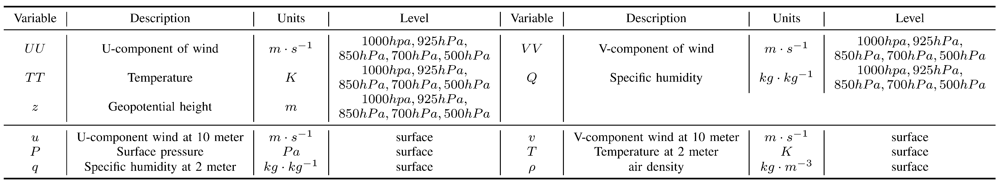

<div align="center">
    <h2>
        DeepPhysiNet: Bridging Deep Learning and Atmospheric Physics for Accurate and Continuous Weather Modeling    
    </h2>
</div>


[](LICENSE)
[](https://arxiv.org/abs/2401.04125)

<div align="center">
    
</div>

## Introduction

This repository is the code implementation of the paper [DeepPhysiNet: Bridging Deep Learning and Atmospheric Physics for Accurate and Continuous Weather Modeling](https://arxiv.org/abs/2401.0412).

The current branch has been tested under PyTorch 2.x and CUDA 12.1, supports Python 3.7+, and is compatible with most CUDA versions.

## TODO


- [x] Download and make label dataset

- [ ] Parameters details in config file

- [ ] Model inference on grid and station level

- [ ] More comprehensive validation and code testing

## Table of Contents

- [Introduction](#Introduction)
- [TODO](#TODO)
- [Table of Contents](#Table-of-Contents)
- [Installation](#Installation)
- [Dataset Preparation](#Dataset-Preparation)
- [Model Training](#Model-Training)
- [Model Inference](#Inference)
- [Citation](#Citation)
- [License](#License)
- [Contact](#Contact)

## Installation

### Dependencies

- Linux or Windows
- GDAL 3.0 or higher, recommended 3.6.2
- Python 3.7+, recommended 3.10
- PyTorch 2.0 or higher, recommended 2.1
- CUDA 11.7 or higher, recommended 12.1
- [cfgrib](https://github.com/ecmwf/cfgrib) 0.9 or higher, recommended 0.9.10
- [xarray](https://docs.xarray.dev/en/latest/getting-started-guide/installing.html) 2023.12.0
- [NETCDF4](https://unidata.github.io/netcdf4-python/) 1.6.5 or higher, recommended 1.6.5
- [Metpy](https://unidata.github.io/MetPy/latest/userguide/installguide.html) 1.0 or higher, recommended 1.6
 
### Environment Installation

We recommend using Miniconda for installation. The following command will create a virtual environment named `DeepPhysiNet` and install PyTorch,GDAL and other libraries.

Note: If you have experience with Conda, pytorch, GDAL and have already installed them, you can skip to the next section. Otherwise, you can follow these steps to prepare.

<details>


**Step 0**: Install [Miniconda](https://docs.conda.io/projects/miniconda/en/latest/index.html).


**Step 1**: Create a virtual environment named `DeepPhysiNet` and activate it.


```shell

conda create -n DeepPhysiNet python=3.10 -y

[conda] activate DeepPhysiNet

```


**Step 2**: Install [GDAL](https://gdal.org/): 


```shell

conda install gdal==3.6.2

```


**Step 3**: Install [PyTorch](https://pytorch.org/get-started/locally/).


Linux:

```shell

pip install torch torchvision torchaudio

```

Windows:

```shell

pip install torch torchvision torchaudio --index-url https://download.pytorch.org/whl/cu121

```


**Step 4**: Install [MMCV](https://mmcv.readthedocs.io/en/latest/get_started/installation.html).


```shell

pip install -U openmim

mim install "mmcv>=2.0.0"

```


**Step 5**:Install [cfgrib](https://github.com/ecmwf/cfgrib).

```shell

conda install -c conda-forge cfgrib

```


**Step 6**: Install other dependencies.


```shell

pip install -r requirement.txt

```

</details>

## Dataset Preparation

The IFS data we use for training is collected from [TIGGE](https://apps.ecmwf.int/datasets/data/tigge/levtype=sfc/type=cf/) 
and is in grib format. The variables for training is listed as follows:

<div align="center">

  

</div>

The reanalysis data we use as ground truth comes from [ERA5](https://cds.climate.copernicus.eu/cdsapp#!/dataset/reanalysis-era5-single-levels?tab=form).

Here I will give a detailed instructions to prepare training dataset,
including data downloading, convert, extraction and others. If you want to use your
own dataset, just ensure that the organization of the dataset meets the requirements as follows:
- Each variable listed in the above table is saved in a separate tiff image file.
- The number of levels equals to the number of image channels.
- Training data are organized by years.

<details>


### Input data from TIGGE

**Step 1**: Download


You can follow the instruction from [TIGGE](https://apps.ecmwf.int/datasets/data/tigge/levtype=sfc/type=cf/). 

Also, you can just access the data through the following adrresses:</br>

[Address for surface data](https://apps.ecmwf.int/datasets/data/tigge/levtype=sfc/type=cf/?date_year_month=201902&origin-time=kwbc;00:00:00&step=0,6,12,18,24,30,36,42,48,54,60,66,72,78,84,90,96,102,108,114,120,126,132,138,144,150,156,162,168,174,180,186,192,198,204,210,216,222,228,234,240,246,252,258,264,270,276,282,288,294,300,306,312,318,324,330,336,342,348,354,360&param=168,167,165,166,134)</br>

[Address for pressure data](https://apps.ecmwf.int/datasets/data/tigge/levtype=pl/type=cf/?date_year_month=201701&origin-time=kwbc;00:00:00&step=0,6,12,18,24,30,36,42,48,54,60,66,72,78,84,90,96,102,108,114,120,126,132,138,144,150,156,162,168,174,180,186,192,198,204,210,216,222,228,234,240,246,252,258,264,270,276,282,288,294,300,306,312,318,324,330,336,342,348,354,360&levelist-param=1000;156,925;156,850;156,700;156,500;156,1000;133,925;133,850;133,700;133,500;133,1000;130,925;130,850;130,700;130,500;130,1000;131,925;131,850;131,700;131,500;131,1000;132,925;132,850;132,700;132,500;132)


Please select the same study area same in the paper with boundary with $72^{\circ} E$ to $136^{\circ} E$ and $18^{\circ} N$ to $54^{\circ} N$.


The downloaded data are in the format of Grib. You should save the dataset with level of surface and pressure to a separate path, respectively. Below is an example.


```

${GRIB_DATASET_ROOT} # Dataset root directory, for example: /home/username/data/NWPU

├── pressure

│   ├── pressure_202107.grib

│   ├── pressure_202108.grib

│   └── pressure_202109.grib

└── surface

    ├── surface_202107.grib

    ├── surface_202108.grib

    └── surface_202109.grib

```


**Step 2** Data Conversion and Extraction


For convenience, convert the downloaded files with Grib format to NC format.</br>


```shell

python tools/cvt_grib_to_nc.py --data_path $GRIB_DATASET_ROOT/pressure --result_path $NC_DATASET_ROOT --pressure --num_threads 0

```


```shell

python tools/cvt_grib_to_nc.py --data_path $GRIB_DATASET_ROOT/surface --result_path $NC_DATASET_ROOT --num_threads 0

```


Then extract the variables for training and inference. 


```shell

python tools/extract_variable_from_nc.py --data_path $NC_DATASET_ROOT --result_path $Variable_ROOT --pressure  --num_threads 0

```


```shell

python tools/extract_variable_from_nc.py --data_path $NC_DATASET_ROOT --result_path $Variable_ROOT  --num_threads 0

```


**Step 3** Calculate extra variable and Statistic


The input variable of air intensity should be calculated:

```shell

python tools/calc_rho.py --data_path $Variable_ROOT  --num_threads 0

```


Now, we have collected all variables required for training, but before training, we need to calculate each variabel's mean and standard variation for normalization.

```shell

python tools/calc_mean_std.py --data_path $Variable_ROOT --result_path $Variable_ROOT --num_threads 0

```


Also, we need to check the input data and generate a temp file for training for convenience.

```shell

python tools/generate_input_map.py --data_path $Variable_ROOT --result_file $Variable_ROOT/input_map.pickel --start_time  2007-01-01-00:00:00 --end_time 2020-12-31-12:00:00 

```


Other data can be found in [auxiliary data](./auxiliary_data).


### Labels from ERA5

**Step 1**: Download

ERA5 data can be downloaded from [ERA5](https://cds.climate.copernicus.eu/cdsapp#!/dataset/reanalysis-era5-single-levels?tab=form).

Please select the format of NetCDF and same study area same in the paper with boundary with $72^{\circ} E$ to $136^{\circ} E$ and $18^{\circ} N$ to $54^{\circ} N$.

Also note that the target resolution should be $0.25^{\circ}$ and 1 hour.

**step 2**: Variables Extraction

Use the following commands to extract variables from ERA5 as training labels.

```shell
python tool/extract_variable_from_ERA5.py --data_path $ERA_ROOT --result_path $LABEL_ROOT --num_threads 2
```

**step 3**: Calculate extra variable


The input variable of air intensity should be calculated:

```shell
python tools/calc_rho.py --data_path $LABEL_ROOT  --num_threads 0
```


</details>

## Model Training

### Config File

We provide the configuration files used in the paper, which can be found in the `configs` folder. 
Below we provide an analysis of some of the main parameters. 

<details>


**Parameter Parsing**:


</details>


### Training

```shell
python tools/train.py configs/xxx.py  # xxx.py is the configuration file you want to use
```

## Inference
_TODO_

## Citation

If you use the code or performance benchmarks of this project in your research, please refer to the bibtex below to cite.

```
@misc{li2024deepphysinet,
      title={DeepPhysiNet: Bridging Deep Learning and Atmospheric Physics for Accurate and Continuous Weather Modeling}, 
      author={Wenyuan Li and Zili Liu and Keyan Chen and Hao Chen and Shunlin Liang and Zhengxia Zou and Zhenwei Shi},
      year={2024},
      eprint={2401.04125},
      archivePrefix={arXiv},
      primaryClass={physics.ao-ph}
}
```

## License

This project is licensed under the [Apache 2.0 license](LICENSE).

## Contact

If you have any other questions or suggestions, please contact Wenyuan Li ([liwayne@hku.hk](mailto:liwayne@hku.hk) or [liwenyuan@buaa.edu.cn](mailto:liwenyuan@buaa.edu.cn)).
